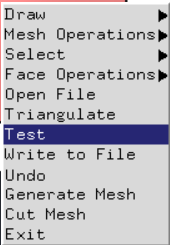
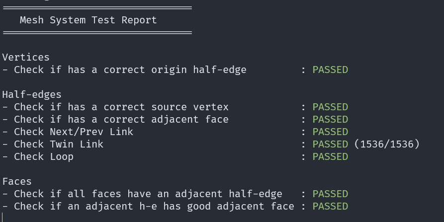
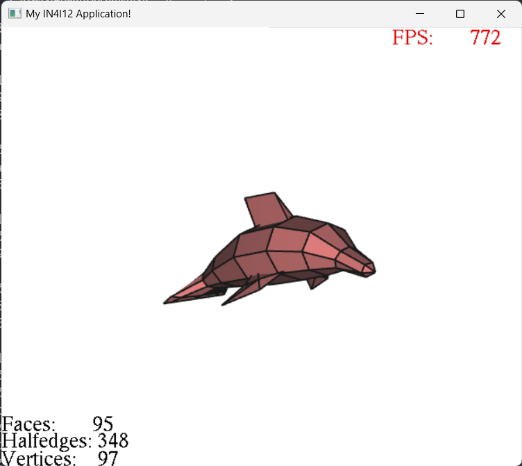
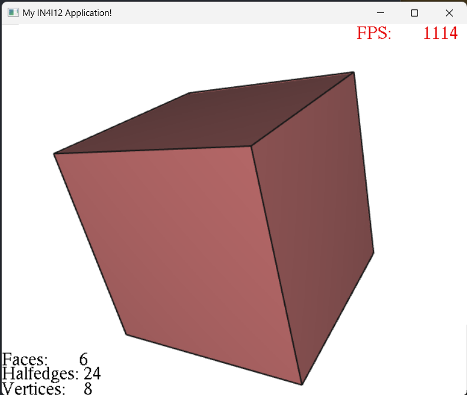
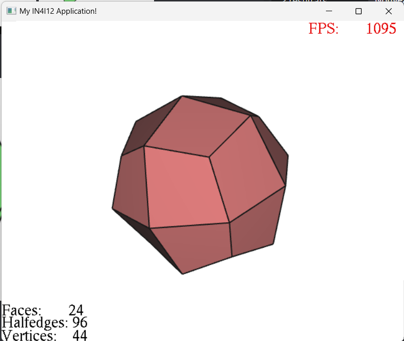
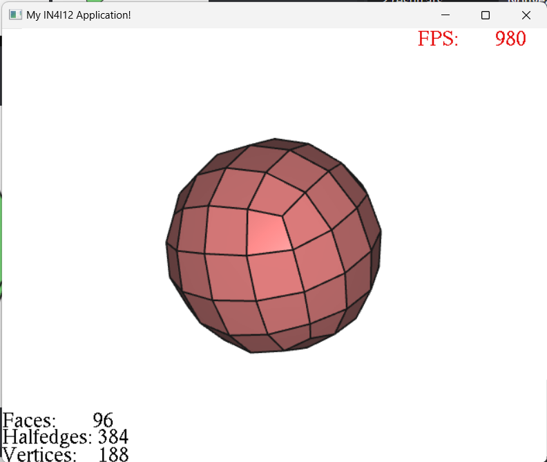

# Geometry modeling project

This school project is in C++. I did during my 4th year at ESIEE Paris to validate the Geometry Modeling unit. This project was very good to introduce us to this field and help me to understand better the halfedge structure.

## Functions

### Summary

| Name  |  Succeed | Difficulty (4 me) | Tests passed | Date |
|---|---|---|---|---|
| ReadFile |  Yes       | Hard      |:green_circle:| 05/10
| Triangulate  | Yes     |  Medium   |:green_circle:| 15/10
| Simplification | Yes  |  Medium   |:green_circle:| 10/11
| ComputsNormals | Yes  |  Easy     |:green_circle:| 17/12
| Silhouette | Yes      |  Easy     |:green_circle:| 10/11
| Catmull-Clark | Yes   |  Hard        |:green_circle:| 17/12

### Tests

I created a button to test my mesh.
To deploy it `right click + Test`.

When I deploy it, I have a diplay in a console like this.

## Work

### ReadFile

### ComputeNormals

### Triangulate

### Simplification

### Silhouette

### Catmull-Clark

## License

No License