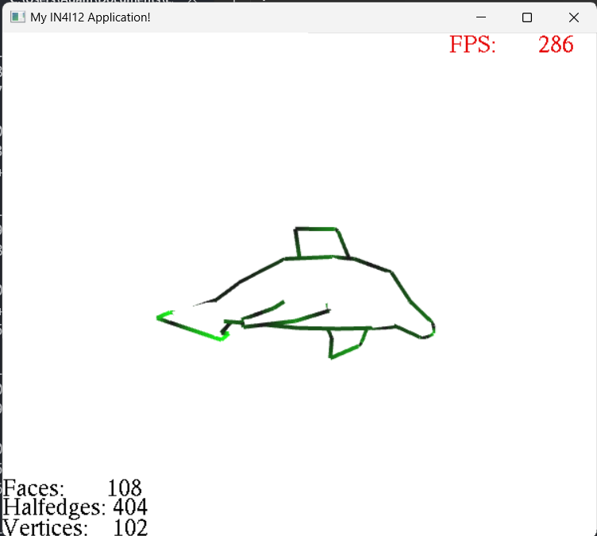

# Geometry modeling project

This school project is in C++. I did during my 4th year at ESIEE Paris to validate the Geometry Modeling unit. This project was very good to introduce us to this field and help me to understand better the halfedge structure.

## Installation

Use Visual Studio by preference the [2022](https://visualstudio.microsoft.com/fr/thank-you-downloading-visual-studio/?sku=Professional&channel=Release&version=VS2022&source=VSLandingPage&cid=2030&passive=false) version.

```bash
git clone https://github.com/aithamid/geometry-modeling.git
```

## Usage

Click on `myproj.sln` file it will open the VS Project. 

Run the project with `Ctrl + F5`

## Functions

### Summary

| Name  |  Succeed | Difficulty (4 me) | Tests passed |
|---|---|---|---|
| ReadFile |  Yes       | Hard      |:green_circle:|
| Tringulate  | Yes     |  Medium   |:green_circle:|
| Simplification | Yes  |  Medium   |:green_circle:|
| ComputsNormals | Yes  |  Easy     |:green_circle:|
| Silhouette | Yes      |  Easy     |:green_circle:|
| Catmull-Clark | Yes   |  -        |:green_circle:|

### Tests

## Work

### ReadFile


### ComputeNormals


### Triangulate


### Simplification


### Silhouette



### Catmull-Clark

No photo for the moment


## License

No License